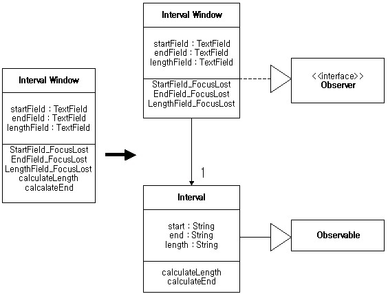

# 리팩토링 (8~9장)
## 데이터 구성 (Organizing Data)

* **Self Encapsulate Field** : 접근자를 사용해야 할 때
* **Replace Data Value with Object** : 멍청한 데이터를 똑똑한 객체로 바꿀 때
* **Change Value to Reference** : 객체가 프로그램의 다른 많은 부분에서도 사용될 필요가 있는 인스턴스라는 것을 알게 될 때<br>
  <-> **Change Reference to Value**
* **Replace Array with Object** : 데이터 구조로 사용되는 배열을 보게 될 때
* **Duplicate Observed Data** : GUI에서 비즈니스 로직 처리 분리할 때
* **Change Unidirectional Association to Bidirectional** : 단방향 링크에 새로운 양방향 기능을 지원하기 위해
* **Change Bidirectional Association to Unidirectional** : 양방향 링크가 더 이상 필요없다는 것을 알게 되었을 때
* **Replace Magic Number with Symbolic Constant** : 특별한 의미를 가지는 숫자 리터럴이 있을 때
* **Encapsulate Field** : public 데이터가 발가벗고 돌아다닐 때
* **Encapsulate Collection** : 데이터가 컬렉션이면 특별한 프로토콜이 필요하므로
* **Replace Record with Data Class** : 전체 레코드가 모두 드러나 있을 때
* **Replace Type Code with Class** : 코드가 정보를 위한 것이고 클래스의 동작을 바꾸지 않을 때
* **Replace Type Code with Subclasses** : 타입 코드에 의해 클래스의 동작이 영향을 받을 때<br>
  <-> **Replace Subclass with Fields**
* **Replace Type Code with State/Strategy** : Replace Type Code with Subclasse 사용 할 수 없을 때 (보다 융통성이 필요할 때)
<br>
<br>
<br>

### Self Encapsulate Field
필드에 직접 접근하고 있는데 필드에 대한 결합이 이상해지면<br>
**그 필드에 대한 get/set 메소드를 만들고 항상 이 메소드를 사용하여 필드에 접근하라.**

```java
private int _low, _high;
boolean includes(int arg) {
    return arg >= _low && arg <= _high;
}
```
<center></center>

```java
private int _low, _high;
boolean includes(int arg) {
    return arg >= getLow() && arg <= getHigh();
}
int getLow() {return _low;}
int getHigh() {return _high;}
```
<br>
<br>
<br>

### Replace Data Value with Object
추가적인 데이터나 동작을 필요로 하는 데이터 아이템이 있을 때는,<br>
**데이터 아이템을 객체로 바꾸어라.**

<center></center>

```java
class Order {
    String customer;
}
```
<center></center>

```java
class Customer {
	String name;
	public Customer(String name) {
		this.name = name;
	}
}
class Order {
	Customer customer;
	public Order(String customerName) {
		customer = new Customer(customerName);
	}
}
```
<br>
<br>
<br>

### Change Value to Reference
동일한 인스턴스를 여러 개 가지고 있는 클래스가 있고 여러 개의 동일한 인스턴스를 하나의 객체로 바꾸고 싶으면,<br>
**그 객체를 참조 객체로 바꾸어라.**
<center></center>

```java
class Customer {
	String name;
	public Customer(String name) {
		this.name = name;
	}
}
class Order {
	Customer customer;
	public Order(String customerName) {
		customer = new Customer(customerName);
	}
}
```
<center></center>

```java
class Customer {
	private static Dictionary instances = new Hashtable();
	String name;
	public static Customer getNamed(String name) {
		return (Customer)instances.get(name);
	}
}
class Order {
	Customer customer;
	public Order(String customerName) {
		customer = Customer.getNamed(customerName);
	}
}
```
<br>
<br>
<br>

### Change Reference to Value
작고, 불변성이고, 관리하기가 어려운 참조객체(reference Object)가 있는 경우,<br>
**그것을 값 객체(value Object)로 바꾸어라.**
<center></center>
<br>
<br>
<br>

### Replace Array with Object
배열의 특정 요소가 다른 뜻을 가지고 있다면,<br>
**배열을 각각의 요소에 대한 필드를 가지는 객체로 바꿔라.**

```java
String[] row = new String[3];
    row [0] = "Liverpool";
    row [1] = "15";
```
<center></center>

```java
Performance row = new Performance();
    row.setName("Liverpool");
    row.setWins("15");
```
<br>
<br>
<br>

### Duplicate Observed Data
GUI 컨트롤에서만 사용 가능한 도메인(domain) 데이터가 있고, 도메인 메소스에서 접근이 필요한 경우,<br>
**그 데이터를 도메인 객체로 복사하고, 옵저버(observer)를 두어 두 데이터를 동기화하라.**


<center></center>

```java
class IntervalWindow {
	TextField startField;
	TextField endField;
	TextField lengthField;

	void StarField_FocusLost();
	void EndField_FocusLost();
	void LengthField_FocusLost();
	void calculateLength();
	void calculateEnd();
}
```
<center></center>

```java
interface Observer {
	void update();
}
class IntervalWindow implements Observer {
	Interval subject;
	TextField startField;
	TextField endField;
	TextField lengthField;
	public IntervalWindow() {
		subject = new Interval();
		subject.addObserver(this);
		update();
	}
	@Override
	public void update() {
	}
	void StarField_FocusLost() {
		subject.calculateLength();
	}
	void EndField_FocusLost() {
		subject.calculateLength();
	}
	void LengthField_FocusLost() {
		subject.calculateEnd();
	}
}

class Observable() {
	Observer observer;
	public void addObserver(Observer observer) {
		this.observer = observer;
	}
	public void notifyObservers() {
		observer.update();
	}
}
class Interval extends Observable {
	String start;
	String end;
	String length;
	public void calculateLength() {
		notifyObservers();
	}
	public void calculateEnd() {
		notifyObservers();
	}
}
```
<br>
<br>
<br>

### Change Unidirectional Association to Bidirectional
각각 서로의 기능을 필요로 하는 클래스가 있는데 링크가 한쪽 방향으로만 되어 있는 경우,<br>
**반대 방향으로 포인터를 추가하고, 수정자(modifier)가 양쪽 세트(set)를 모두 업데이트 하게 변경하라.**
<center></center>

```java
class Customer {
	String name;
}
class Order {
	Customer customer;
	void setCustomer(Customer customer) {
		this.customer = customer;
	}
}
```
<center></center>

```java
class Customer {
	String name;

	Order order;
	void setOrder(Order order) {
		this.order = order;
	}
}
class Order {
	Customer customer;
	void setCustomer(Customer customer) {
		this.customer = customer;
	}
}
```
<br>
<br>
<br>

### Change Bidirectional Association to Unidirectional
서로 링크를 가지는 두 개의 클래스에서 한쪽이 다른 한쪽을 더 이상 필요로 하지 않을 때는,<br>
**불필요한 링크를 제거하라.**
<center></center>
<br>
<br>
<br>

### Replace Magic Number with Symbolic Constant
특별한 의미를 가지는 숫자 리터럴이 있으면,<br>
**상수를 만들고, 의미를 잘 나타내도록 이름을 지은다음, 숫자를 상수로 바꾸어라.**

```java
double potentialEnergy(double mass, double height) {
    return mass * 9.91 * height;
}
```
<center></center>

```java
double potentialEnergy(double mass, double height) {
    return mass * GRAVITATION_CONSTNAT * height;
}
static final double GRAVITATIONAL_CONSTANT = 9.81;
```
<br>
<br>
<br>

### Encapsulate Field
public 필드가 있는 경우,<br>
**그 필드를 private으로 만들고, 접근자를 제공하라.**

```java
public String _name;
```
<center></center>

```java
private String _name;
public String getName() {return _name;}
public void setName(String arg) { _name = arg;}
```
<br>
<br>
<br>

### Encapsulate Collection
컬렉션을 리턴하는 메소드가 있으면,<br>
**그 메소드가 읽기전용 뷰(read-only view)를 리턴하도록 만들고, add/remove 메소드를 제공하라.**
<center></center>

```java
class Person {
	private Set courses;
	public Set getCourses() {
		return courses;
	}
	public void setCourses(Set courses) {
		return this.courses = courses;
	}
}
```
<center></center>

```java
class Person {
	private Set courses;
	public Set getCourses() {
		return Collections.unmodifiableSet(courses);
	}
	public void addCourse(Course course) {
	}
	public void removeCourse(Course course) {
	}
}
```
<br>
<br>
<br>

### Replace Record with Data Class
전통적인 프로그래밍 환경에서의 레코드 구조에 대한 인터페이스가 필요한 경우,<br>
**그 레코드를 위한 데이터 객체를 만들어라.**
<br>
<br>
<br>

### Replace Type Code with Class
클래스의 동작에 영향을 미치지 않는 숫자로 된 타입코드가 있으면,<br>
**숫자를 클래스로 바꾸어라.**
<center></center>

```java
class Person {
	public static final int O = 0;
	public static final int A = 1;
	public static final int B = 2;
	public static final int AB = 3;
	private int bloodGroup;
	
	public Person(int bloodGroup) {
	    this.bloodGroup = bloodGroup;
	}
}
```
<center></center>

```java
class BloodGroup {
	public static final BloodGroup O = new BloodGroup(0);
	public static final BloodGroup A = new BloodGroup(1);
	public static final BloodGroup B = new BloodGroup(2);
	public static final BloodGroup AB = new BloodGroup(3);
	private final int code;
	
	private BloodGroup(int code) {
		this.code = code;
	}
}

class Person {
	BloodGroup bloodGroup;
	public Person(BloodGroup bloodGroup) {
		this.bloodGroup = bloodGroup;
	}
}
```
<br>
<br>
<br>

### Replace Type Code with Subclasses
클래스의 동작에 영향을 미치는 변경 불가능한 타입 코드가 있다면,<br>
**타입 코드를 서브클래스로 바꾸어라.**
<center></center>

```java
class Employee {
	static final int ENGINEER = 0;
	static final int SALESMAN = 1;
	private int type;
}
```

<center></center>

```java
abstract class Employee {
}
class Engineer extends Employee {
}
class Salesman extends Employee {
}

```
<br>
<br>
<br>

### Replace Type code with State/Strategy
클래스의 동작에 영향을 미치는 타입 코드가 있지만 서브클래싱을 할 수 없을 때는,<br>
**타입 코드를 스테이트(State) 객체로 바꾸어라.**
<center></center>

```java
class Employee {
	static final int ENGINEER = 0;
	static final int SALESMAN = 1;
	private int type;
}
```
<center></center>


```java
class Employee {
	EmployeeType employeeType;
}
abstract class EmployeeType {
}
class Engineer extends EmployeeType {
}
class Salesman extends EmployeeType {
}

```
<br>
<br>
<br>

### Replace Subclass with Fields
상수 데이터를 리턴하면서 메소드만 다른 서브클래스가 있으면,<br>
**그 메소드를 수퍼클래스의 필드로 바꾸고 서브클래스를 제거하라.**

```java
abstract class Person {
	abstract char getCode();
}
class Male extends Person {
	@Override
	char getCode() {
		return 'M';
	}
}
class Female extends Person {
	@Override
	char getCode() {
		return 'F';
	}
}
```
<center></center>


```java
class Person {
	char code;
	private Person(char code) {
		this.code = code;
	}
	static Person createMale() {
		return new Person('M');
	}
	static Person createFemale() {
		return new Person('F');
	}
	char getCode() {
		return code;
	}
}

```
<br>
<br>
<br>

## 조건문의 단순화 (Simplifying Conditional Expressions)
* **Decompose Conditional** : 조건문을 조각으로 분해할 때
* **Consolidate Conditional Expression** : 여러 개의 조건 검사가 결과적으로 모두 같은 효과를 나타낼 때
* **Consolidate Duplicate Conditional Fragments** : 조건문 안에 있는 중복된 코드를 제거하기 위해
* **Remove Control Flag** : 다루기 힘든 컨트롤 플래그 제거하기 위해
* **Replace Nested Conditional with Guard Clauses** : 조건문에서 특별한 경우를 명확하게 하기 위해
* **Replace Conditional with Polymorphism** : 객체지향 프로그램에서 switch문을 제거하기 위해
* **Introduce Null Object** : 다형성을 사용할 때 null 체크 하지 않기 위해
* **Introduce Assertion** : 어떤 상태를 가정하고 있을 때
<br>
<br>
<br>

### Decompose Conditional
복잡한 조건문(if-then-else)이 있는 경우,<br>
**조건, then 부분, 그리고 else 부분에서 메소드를 추출하라.**

```java
if (data.before( SUMMER_START ) || data.after(SUMMER_END) )
    charge = quantity * _winterRate + _winterServeceCharge;
else charge = quantity * _summerRate;
```
<center></center>

```java
if (notSummer(date))
    charge = winterCharge(quantity);
else charge = summerCharge(quatity);
```
<br>
<br>
<br>

### Consolidate Conditional Expression
같은 결과를 초래하는 일련의 조건 테스트가 있는 경우,<br>
**그것을 하나의 조건 식으로 결합하여 뽑아내라.**

```java
double disabilityAmount() {
    if (_seniority < 2) return 0;
    if ( _monthsDisabled > 12) return 0;
    if ( _isPartTime) return 0;
    // compute the disability amount
```
<center></center>

```java
double disabilityAmount() {
    if (isNotEligableForDisability()) return 0;
    // compute the disability amount;
```
<br>
<br>
<br>

### Consolidate Duplicate Conditional Fragments
동일한 코드 조각이 조건문의 모든 분기 안에 있는 경우,<br>
**동일한 코드를 조건문 밖으로 옮겨라.**

```java
if (isSpecialDeal()) {
    total = price * 0.95;
    send();
}
else {
    total = price * 0.98;
    send();
}
```
<center></center>

```java
if (isSpecialDeal())
    total = price * 0.95
else
    total = price * 0.98;
send();
```
<br>
<br>
<br>

### Remove Control Flag
일련의 boolean 식에서 컨트롤 플래그 역할을 하는 변수가 있는 경우,<br>
**break 또는 return을 대신 사용하라.**
<br>
<br>
<br>

### Replace Nested Conditional with Guard Clauses
메소드가 정상적인 실행 경로를 불명확하게 하는 조건 동작을 가지고 있는 경우,<br>
**모든 특별한 경우에 대해서 보호절(guard clause)을 사용하라.**

```java
double getPayAmount() {
    double result;
    if ( _isDead) result = deadAmount();
    else {
        if (_isSeparated) result = separatedAmount();
        else {
            if (_isRetried) result = retiredAmount();
            else result = normalPayAmount();
        };
    }
    return result;
}
```
<center></center>

```java
double getPayAmount() {
    if (_isDead) return deadAmount();
    if (_isSeparated) return separatedAmount();
    if (_isRetried) return retiredAmount();
    return normalPayAmount();
}
```
<br>
<br>
<br>

### Replace Conditional with Polymorphism
객체의 타입에 따라 다른 동작을 선택하는 조건문을 가지고 있는 경우,<br>
**조건문의 각 부분을 서브클래스에 있는 오버라이딩 메소드로 옮겨라. 그리고 원래 메소드를 abstract로 만들어라.**

```java
double getSpeed() {
    switch (_type) {
        case EUROPEAN:
            return getBaseSpeed();
        case AFRICAN:
            return getBaseSpeed() - getLoadFactor() * _numberofCoconuts;
        case NORWEGIAN_BLUE:
            return (_isNailed) ? 0 : getBaseSpeed(_voltage);
    }
    throw new RuntimeException ("Should be unreachable");
}
```
<center></center>

```java
abstract class Bird {
	abstract double getSpeed();
}
class European extends Bird {
	@override
	double getSpeed() {
	}
}
class African extends Bird {
	@override
	double getSpeed() {
	}
}
class NorwegianBlue extends Bird {
	@override
	double getSpeed() {
	}
}
```
<center></center>
<br>
<br>
<br>

### Introduce Null Object
null 체크를 반복적으로 하고 있다면,<br>
**null 값을 null 객체로 대체하라.**

```java
if (customer == null) plan = BillingPlan.basic();
else plan = customer.getPlan();
```
<center></center>

```java
class Customer {
	BillingPlan getPlan()
}
class NullCustomer extends Customer() {
	@override
    BillingPlan getPlan() {
		BillingPlan.basic();
    }
}
```
<br>
<br>
<br>

### Introduce Assertion
코드의 한 부분이 프로그램의 상태에 대하여 어떤 것을 가정하고 있으면,<br>
**assertion을 써서 가정을 명시되게(explicit) 만들어라.**

```java
double getExpenseLimit() {
    //should have eigher expense limit or a primary project
    return (_expenseLimit != NULL_EXPENSE)?
            _expenseLimit:
            _primaryProject.getMemberExpenseLimit();
}
```
<center></center>

```java
double getExpenseLimit() {
    Assert.isTrue(_expenseLimit != NULL_EXPENSE || _primaryProject != null);
    return (_expenseLimit != NULL_EXPENSE)?
            _expenseLimit:
           _primaryProject.getMemberExpenseLimit();
}
```
<br>
<br>
<br>

## References
* 리팩토링 - 마틴 파울러, 대청
